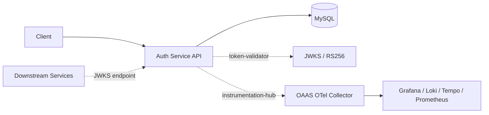

# Auth Service

- JWT-based authentication and RBAC service for microservices.
- Uses [Token Validator](https://github.com/vyavasthita/token-validator) for RS256 JWT signing (JWKS) and token validation.
- Uses [Instrumentation Hub](https://github.com/vyavasthita/instrumentation-hub) to push observability telemetry to [OAAS](https://github.com/vyavasthita/oaas).

---

## Architecture



---

## Getting Started

### Option A — Dev Container (Recommended)

**Prerequisites:** VS Code, Docker Desktop, [Dev Containers extension](https://marketplace.visualstudio.com/items?itemName=ms-vscode-remote.remote-containers)

1. Clone this repo
2. Configure [`.env`](.env) (see table below)
3. Export secrets:
   ```bash
   export AUTH_SERVICE_MYSQL_ROOT_PASSWORD=yourpassword
   export AUTH_SERVICE_SECRET_KEY=yourjwtsecret
   ```
4. Open the folder in VS Code
5. When prompted, click **Reopen in Container**
6. All services (MySQL, Liquibase, API, phpMyAdmin) start automatically
7. Start the API from the VS Code terminal:
   ```bash
   python -m uvicorn src.api:app --host 0.0.0.0 --port ${API_PORT} --reload
   ```
8. Swagger UI: **http://localhost:2002/auth-service/docs**

> Ensure [OAAS](https://github.com/vyavasthita/oaas) is running first for observability.

### Option B — Makefile

**Prerequisites:** Docker Desktop / Docker Engine + Compose, Make

1. Clone this repo
2. Configure [`.env`](.env) (see table below)
3. Run:
   ```bash
   export AUTH_SERVICE_MYSQL_ROOT_PASSWORD=yourpassword
   export AUTH_SERVICE_SECRET_KEY=yourjwtsecret
   make build   # first time or after dependency changes
   make up
   ```

Swagger UI: **http://localhost:2002/auth-service/docs**

### `.env` Configuration

| Variable | Default | Description |
|----------|---------|-------------|
| `OBSERVABILITY_NETWORK_NAME` | `oaas-observability-net` | **Must match OAAS `.env`** |
| `SERVICE_NAME` | `auth-service` | Service name (OTEL resource + API root path) |
| `MYSQL_HOST_PORT` | `2001` | MySQL host port |
| `API_PORT` | `2002` | Auth Service API port |
| `PHPMYADMIN_HOST_PORT` | `2003` | phpMyAdmin port |
| `MYSQL_PORT` | `3306` | MySQL internal port (do not change) |

---

## Make Commands

| Command | Description |
|---------|-------------|
| `make build` | Build images (runs `poetry update` for instrumentation-hub) |
| `make up` | Start all services |
| `make stop` | Stop containers |
| `make down` | Stop + remove containers |
| `make clean` | Full cleanup (containers, volumes, caches) |
| `make test` | Run unit + functional tests |
| `make fmt` | Format code (ruff) |
| `make lint` | Lint code (ruff) |

---

## Service Endpoints

| Service | URL | Variable |
|---------|-----|----------|
| Auth API | http://localhost:2002/auth-service/docs | `API_PORT` |
| MySQL | localhost:2001 | `MYSQL_HOST_PORT` |
| phpMyAdmin | http://localhost:2003 | `PHPMYADMIN_HOST_PORT` |

---

## API Endpoints

| Method | Path | Description |
|--------|------|-------------|
| `POST` | `/register` | Register a new user |
| `POST` | `/login` | Authenticate and get JWT (RS256) |
| `POST` | `/validate` | Validate JWT token |
| `GET` | `/token/.well-known/jwks.json` | JWKS public key endpoint |
| `GET` | `/health` | Database connectivity check |
| `POST` | `/roles` | Add a new role |
| `GET` | `/users/me` | Get current user details |

---

## Observability

Instrumented via [instrumentation-hub-fastapi](https://github.com/vyavasthita/instrumentation-hub) → pushes to [OAAS](https://github.com/vyavasthita/oaas):

- **Logs** → Loki / OpenSearch
- **Traces** → Tempo / Jaeger
- **Metrics** → Prometheus
- **Middleware** → request/response logging with sensitive field masking
- **Rate-limited logging** on `/health`

`OBSERVABILITY_NETWORK_NAME` must match across both repos for Docker DNS resolution.

---

## Related Repositories

| Repository | Purpose |
|------------|---------|
| [OAAS](https://github.com/vyavasthita/oaas) | Observability stack (Grafana, Loki, Tempo, Prometheus) |
| [Instrumentation Hub](https://github.com/vyavasthita/instrumentation-hub) | Client library for OpenTelemetry instrumentation |
| [Token Validator](https://github.com/vyavasthita/token-validator) | RS256 JWT validation library with JWKS support |

---

## License

Copyright © 2026 Dilip Kumar Sharma. All rights reserved.
