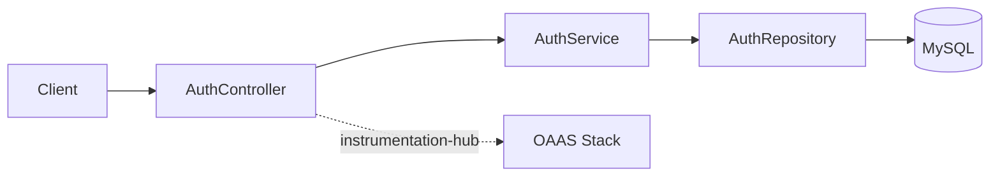
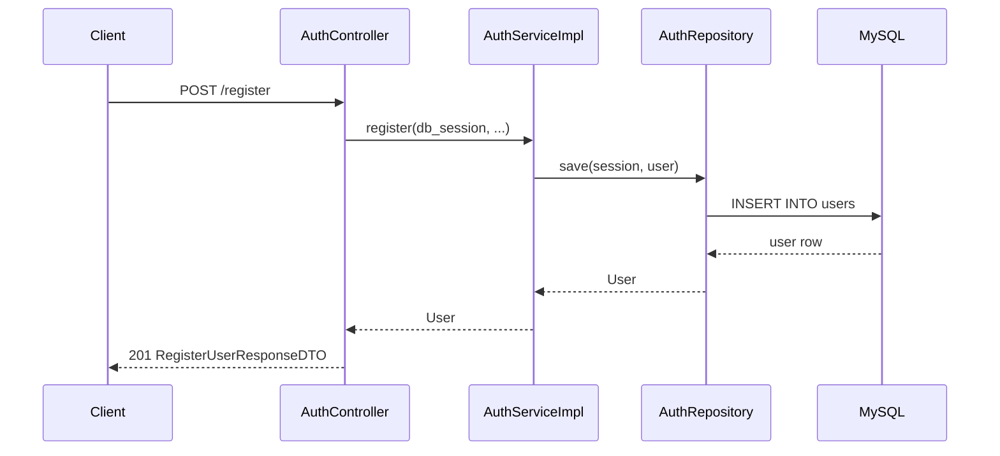

# Auth Service

## About
Authentication and authorization service for modern microservices.

---

## Key Features

- JWT access
- Token expiration
- Role-Based Access Control (RBAC)
- Service-to-service authentication
- OpenTelemetry-based observability (via [OAAS](https://github.com/vyavasthita/oaas) + [instrumentation-hub](https://github.com/vyavasthita/instrumentation-hub))

---

## Tech Stack

- **Backend Framework:** FastAPI (Python)
- **Authentication:** JWT (access and refresh tokens)
- **Authorization:** Role-Based Access Control (RBAC)
- **Database:** MySQL
- **Observability:** OpenTelemetry → OAAS (Grafana, Loki, Tempo, Prometheus)
- **Containerization:** Docker
- **Orchestration:** Docker Compose

---

## Prerequisites

- Docker Desktop / Docker Engine + Compose plugin
- [OAAS](https://github.com/vyavasthita/oaas) running (`make up` in the oaas repo) — provides the observability stack and the shared Docker network

### Configure `.env`

All host-exposed ports and service settings are in the [`.env`](.env) file. Review and adjust to avoid port conflicts:

| Variable | Default | Description |
|----------|---------|-------------|
| `MYSQL_DATABASE` | `auth_service` | Database name |
| `MYSQL_USER` | `root` | Database user |
| `MYSQL_PORT` | `3306` | MySQL internal port (do not change) |
| `MYSQL_HOST_PORT` | `5001` | MySQL host-exposed port |
| `SERVICE_NAME` | `auth-service` | Service name (used in OTEL resource + API root path) |
| `API_PORT` | `5002` | Auth Service API host port |
| `PHPMYADMIN_HOST_PORT` | `5003` | phpMyAdmin host port |
| `LIQUIBASE_LOG_LEVEL` | `DEBUG` | Liquibase migration log level |
| `OBSERVABILITY_NETWORK_NAME` | `oaas-observability-net` | Shared Docker network — **must match the value in OAAS `.env`** |

Sensitive values must be exported as shell environment variables:
```bash
export AUTH_SERVICE_MYSQL_ROOT_PASSWORD=yourpassword
export AUTH_SERVICE_SECRET_KEY=yourjwtsecret
```

---

## Quick Start

```bash
# 1. Ensure OAAS is running (provides observability stack + shared network)
# 2. Export secrets
export AUTH_SERVICE_MYSQL_ROOT_PASSWORD=yourpassword
export AUTH_SERVICE_SECRET_KEY=yourjwtsecret

# 3. Build and start
make build   # first time or after dependency changes (e.g. instrumentation-hub update)
make up
```

Service available at: **http://localhost:5002/auth-service/docs**

---

## Run Tests

```bash
make test
```

---

## Architecture



### Request Lifecycle



---

## Core Roles

| Layer | Class | Responsibility |
|-------|-------|----------------|
| Controller | `AuthController` | HTTP routing, request/response DTOs |
| Service | `AuthServiceImpl` | Business logic, decorators (`is_new_user`, `is_valid_user`, `is_valid_token`) |
| Repository | `AuthRepository` → `BaseRepository` | Async CRUD via `session.add` / `flush` |
| Model | `User` | SQLAlchemy 2.0 `DeclarativeBase` + `Mapped` + `mapped_column()` |
| Config | `Settings` | Composite pydantic-settings (MySQL, JWT, CORS, DB pool, observability) |

---

## API Endpoints

| Method | Path | Description |
|--------|------|-------------|
| `POST` | `/register` | Register a new user |
| `POST` | `/login` | Authenticate and get JWT |
| `POST` | `/validate` | Validate JWT and get user claims |
| `GET` | `/health` | Database connectivity check |
| `POST` | `/roles` | Add a new role |
| `GET` | `/users/me` | Get current user details |

---

## Service Endpoints

| Service | URL | `.env` Variable |
|---------|-----|-----------------|
| Auth Service API | http://localhost:5002/auth-service/docs | `API_PORT` |
| MySQL | localhost:5001 | `MYSQL_HOST_PORT` |
| phpMyAdmin | http://localhost:5003/ | `PHPMYADMIN_HOST_PORT` |

---

## Observability

This service uses [instrumentation-hub-fastapi](https://github.com/vyavasthita/instrumentation-hub) (installed as a Poetry dependency) to push telemetry to the [OAAS](https://github.com/vyavasthita/oaas) observability stack.

**What is instrumented:**
- **Logs** → pushed to OAAS OTel Collector → routed to Loki or OpenSearch
- **Traces** → pushed to OAAS OTel Collector → routed to Tempo or Jaeger
- **Metrics** → pushed to OAAS OTel Collector → scraped by Prometheus
- **Middleware** → request/response logging with sensitive field masking (`password`, `token`, `api_key`, `ssn`, `phone_number`)
- **Rate-limited logging** on `/health` endpoint to prevent log flooding

**Important:** The `OBSERVABILITY_NETWORK_NAME` in this service's `.env` must match the value set in the OAAS `.env` — both services must be on the same Docker network for telemetry to reach the collector.

---

## Project Layout

```
auth-service/
├── .env                             # Shared configuration
├── Makefile                         # Aggregate make targets
├── docker-compose.yaml              # Root compose (includes app + db)
├── components/
│   ├── auth_service_app/
│   │   ├── Dockerfile
│   │   ├── Makefile
│   │   ├── pyproject.toml
│   │   ├── src/
│   │   │   ├── api/
│   │   │   │   ├── bootstrap/       # AppFactory, Initializer, CORS, Instrumentation
│   │   │   │   ├── config/          # Split pydantic-settings (app, mysql, jwt, cors, ...)
│   │   │   │   ├── constants/       # Frozen dataclass constants
│   │   │   │   ├── controllers/     # AuthController, HealthController, RoleController, UserController
│   │   │   │   ├── dependencies/    # Config, DatabaseDependency
│   │   │   │   ├── dtos/            # Request/Response DTOs
│   │   │   │   ├── exceptions/      # Typed exceptions + handlers
│   │   │   │   ├── models/          # SQLAlchemy 2.0 DeclarativeBase models
│   │   │   │   ├── repos/           # Generic base repo + AuthRepository
│   │   │   │   └── services/        # AuthService, RoleService (abstract + impl)
│   │   │   └── utils/               # Logger, Security, JWTUtils, email validator
│   │   ├── tests/                   # Unit + functional tests
│   │   └── smoke_tests/             # Docker-based E2E tests
│   └── auth_service_db/
│       └── migrations/              # Liquibase changelogs
├── docs/
│   └── ToDo.md
└── README.md
```

---

## License

Copyright © 2026 Dilip Kumar Sharma

All rights reserved.

This repository is provided for reference and demonstration purposes only.
No permission is granted to use, copy, modify, or distribute this code, in whole or in part, for any purpose without explicit written permission from the author.
